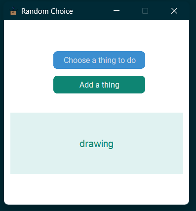
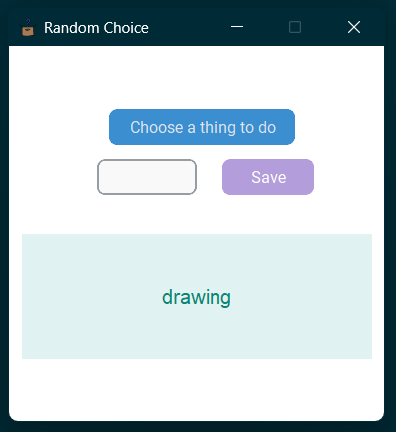

# RandomChoice

A simple python app using customTkinter that selects a random element from a list and shows it.

The program exports all elements from a txt file, or create it in case it doesn't exist.

To download the app:
